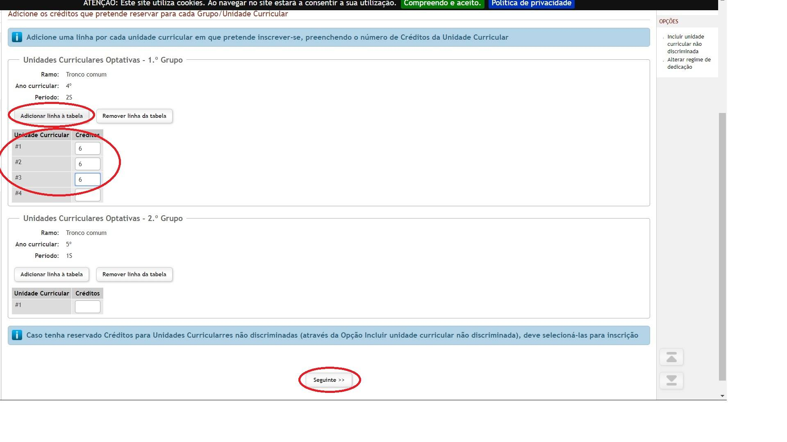
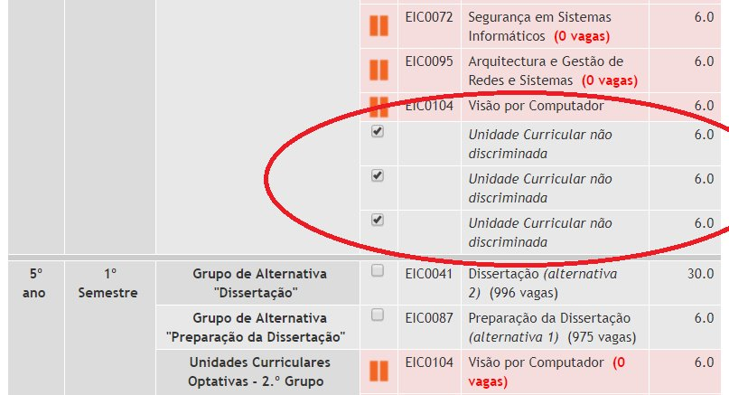

# Instruções para matrícula nas UC's Optativas
(exemplo para o 2º semestre do 4º ano)

* Basicamente vão ter um grupo de unidades curriculares para escolher. Existem UCs que são obrigatórias no plano de estudos e todos têm que fazer, nas optativas têm opção de escolha e podem selecionar aquelas que são do vosso interesse. No caso do 4º ano 2º semestre apenas têm 2 UCs obrigatórias, pelo que podem fazer pelo menos 3 opcionais.
* Uma das optativas neste semestre pode ser uma cadeira qualquer da Universidade do Porto ou cadeiras de outros cursos na FEUP. De forma geral, esta escolha requer a aprovação do diretor do curso [João Carlos Pascoal Faria](https://sigarra.up.pt/feup/pt/func_geral.formview?p_codigo=210006).

1. No lado direito clicar em "Incluir unidade curricular não discriminada"

2. Na nova janela, na área correspondente ao 4º ano, 2º semestre, clicar em "Adicionar linha à tabela" tantas vezes quantas as optativas a que nos queremos matricular. No final tem de ficar uma linha a mais. No seguinte exemplo, queremos matricular em 3 cadeiras, portanto ficam 4 linhas.

3. De volta à tabela das unidades curriculares, assinalar todas as que se quer, incluindo as não discriminadas. Se porventura tiverem assinalado alguma antes dos passos 1 e 2 têm que assinalar novamente.
